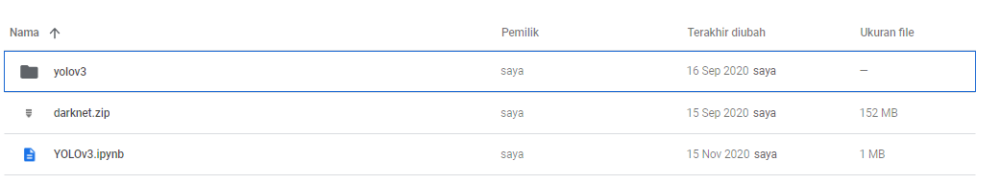
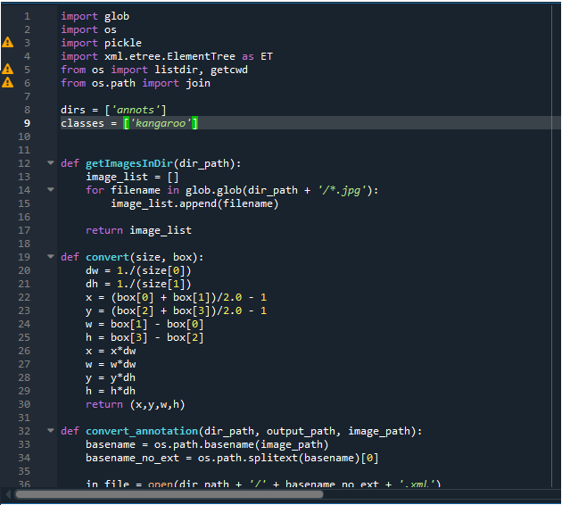
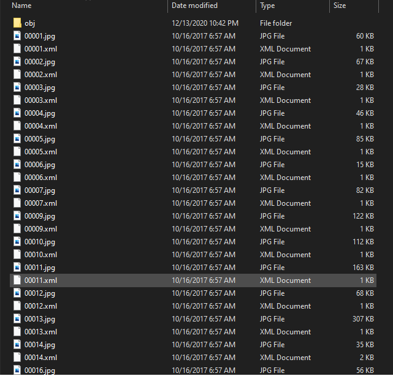
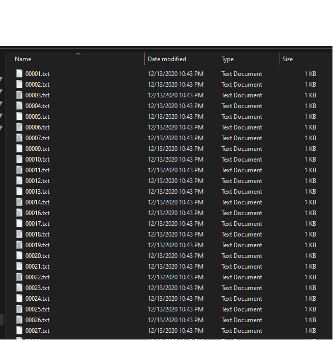
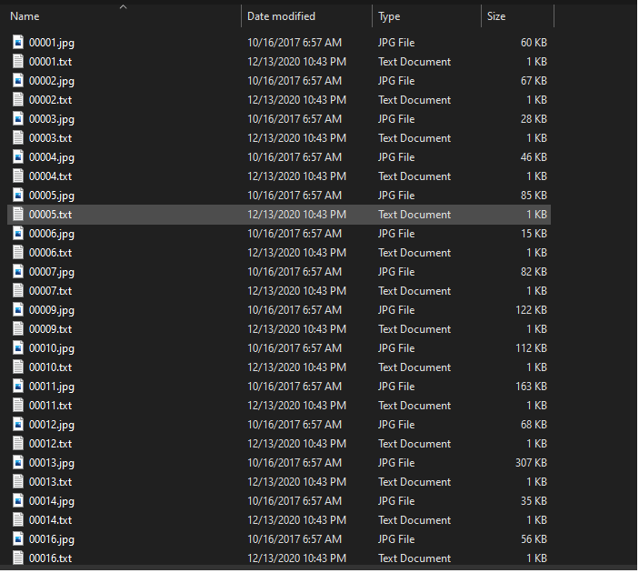
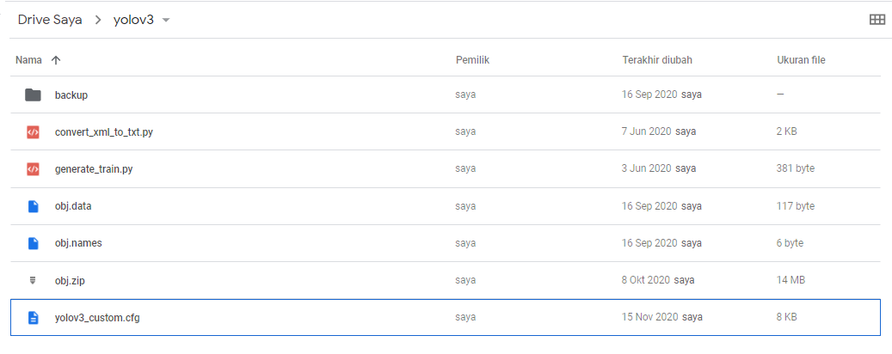
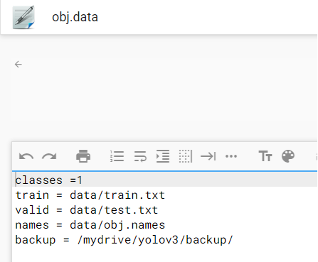
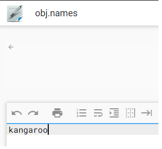
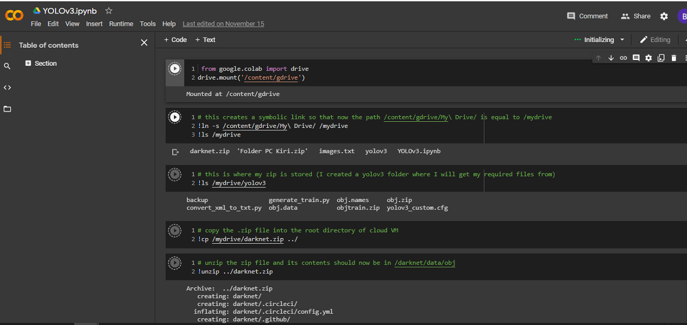

# Custom_dataset_object_detection_using_Yolov3_darknet

## Saya disini menggunakan Google colab

kita akan mengimplemntasikan Yolov3 pada python 3 menggunakan darknet (framework). model ini akan menghasilkan bounding box dan mengklasifikasi 

The repository includes:
* konversi XML to txt (yolo format)
* mengatur data config (obj.names, obj.data, yolov3_custom.cfg,yolov3_detect_custom.cfg)
* training codes menggunakan google colab
* testing codes menggunakan google colab
* Evaluation codes menggunakan google colab (mAP dan FPS)

# Getting Started
* Bounding box setiap gambar dengan menggunakan LabelImg (jika belum mempunyai data)
* convert XML to txt
* training 
* testing
* evaluasi

## Preparasi data seperti berikut

download repositories ini dan download yolov3 dan darknet dibawah

Yolov3  =  
darknet =  

upload data diatas ke google colab seperti gambar berikut:

# step to convert XML to Csv 

## 1. Open xml_to_text.py untuk mnegkonversi
* buka code xml_to_txt.py (just make sure the path right)

file xml dan jpg diletakkan dalam satu folder dan di convert ke txt

file xml sudah di convert ke txt 

* letakkan file txt dan jpg dalam satu folder yang sama, lalu jadikan file zip dengan nama obj

## 2. Persiapan Train
* Upload semua file kedalam google drive

* folder dalam yolov3 :

* ubah jumlah clases didalam obj.data sesuai dengan jumlah kelas yang digunakan

* ubah nama kelas sesuai dengan nama kelas yang digunakan

* ubah config dalam yolov3_custom.cfg

# Step to train  with your own data

## 1. train own dataset
Buka file YOLOv3.ipynb dengan menggunakan google colab

First we must register out dataset and define the label name

then we the part u must change is config for train model

## 2. Execute all program 
just run all part and get the result

## 3. result like this

