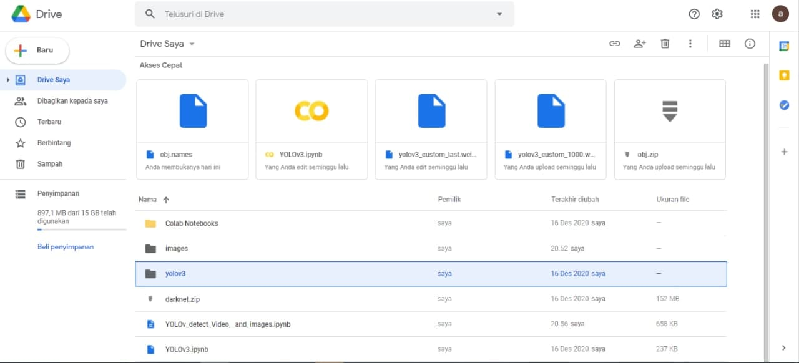
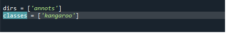
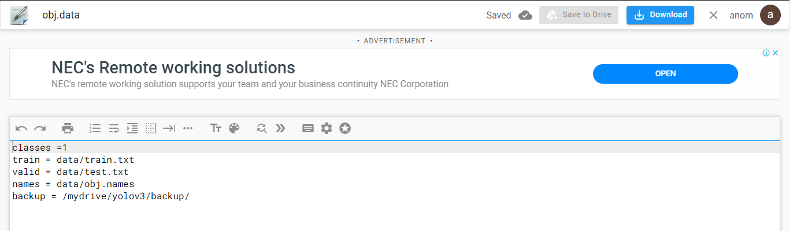
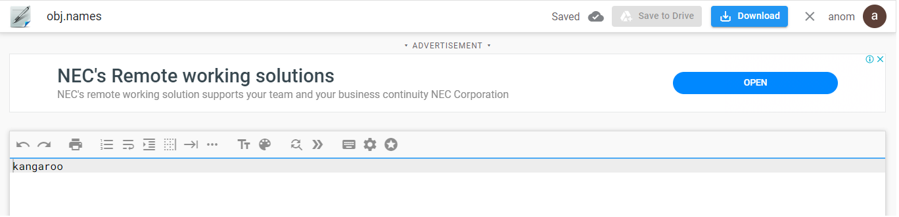
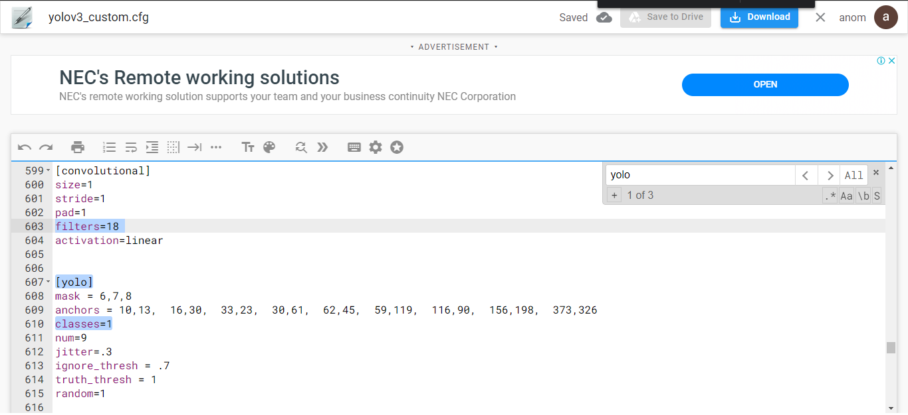
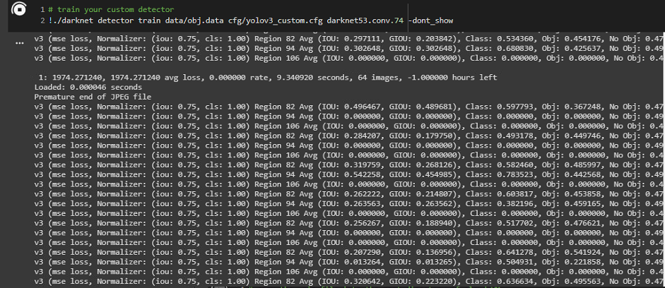

# Custom_dataset_object_detection_using_Yolov3_darknet

## im using google collab cause, easy to install enviroment

This is an implementation of Yolov3 on Python 3 using darknet. The model generates bounding boxes and classify each object in the image.

The repository includes:
* convert xml to txt (yolo format)
* Training Codes
* Testing Video and Image Codes
* Evaluation (AP)/(mAP)

## Installation
1. Clone this repository

2. download Yolov3  : https://drive.google.com/drive/folders/1hLxujr5BgvsipVxTO3eDfcZ-d-_i0ekW?usp=sharing
   donwload darknet : https://drive.google.com/file/d/1lvurLP90g2IhXaBwcg0RRlCd7WGLX1P9/view?usp=sharing
   
 Then put it in google drive like this

# Getting Started
* convert XML to csv
* open convert_XML_to_yolo.py
* Training dataset
* Testing dataset
* Evaluation 

# step to convert XML to txt (yolo format) 

## 1. Prepare dataset and make sure the path 
open code xml_to_yolo.py (just make sure the path right)

the part u must change just class, in this case my class is kangaroo

# Step to train  with your own data

## 1. change some config file first 
This example will explain which part u must change to train your own dataset

* obj.data

 

just change the number of the class ( in this case i use 1 class)

* obj.names

 

change the names of class ( in this case my classes are galbo,kitkat and snickers )

* yolov3_custom.cfg

 

* search yolo ( u can click ctrl+f and search yolo)
* change the names of classes as ur class (in my case 1)
* change the filters = (classes+5)*3 = in my case (18) 
* yolo has 3 part of filter and class so change it 3 times (IMPORTANT)

## 2. Train with own dataset

* just open YOLOv3.ipynb and execute all codes (remmeber to use GPU)

when the training start u can see like this just wait until done and model will be save in yolov4/backup

# Step to test with your own data videos or images

## 1. open YOLOv_detect_Video_and_images.ipynb 
This example will explain which part u must change to test your own data

* YOLOv_detect_Video_and_images.ipynb

just make sure u upload your testing video and image to folder in google drive

the part u must change just the filename of data what u want to test and the u can see the result below

